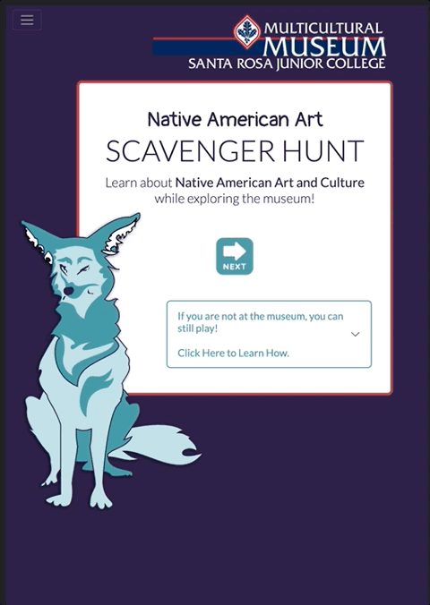
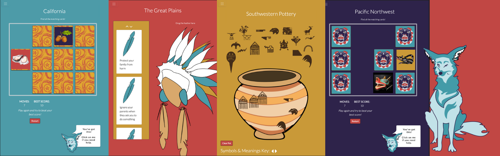
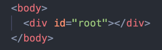

# North American Art Scavenger Hunt E-Learning Game
## Lauren Darrimon, Erin Potter, & Wayne Howlett


[](https://opensource.org/licenses/MIT)    
    
## Description
Interactive e-learning application and scavenger hunt game for the Santa Rosa Junior College Multi-Cultural Museum, built using Node.js, React, Bootstrap React, React Router Dom, and React DnD. 

## Table of Contents

* [Link](#link)
* [Musuem](#musuem)
* [Playing](#playing)
* [Architecture](#architecture)
* [Installation](#installation)
* [Usage](#usage)
* [Contributing](#contributing)
* [Thanks](#thanks)
* [Questions](#questions)
* [License](#license)

## Link 
🔗 
Application: [North American Art Scavenger Hunt Game](https://srjcstudentsites.org/museum/)

Code Repo & Documentation: [GitHub code repo](https://github.com/LaurenDarrimon/srjc-museum-app)



## Museum 
The [Santa Rosa Junior College Multi-Cultural Museum](https://museum.santarosa.edu/) showcases art and cultural objects from four major groupings or regions of Western North America: California, the Southwest, the Great Plains, and the Pacific Northwest Coast. The game is roughly organized around those regions, with a special emphasis on the current indiginous peoples native to the land the college occupies, [the Pomo Tribes](https://en.wikipedia.org/wiki/Pomo) of Northern California. 

## Playing 
This immersive, interactive learning game is meant to be played alongside the exhibits and displays of Native American Art in the physical musuem. The game is designed especially for 4th-grade field trips, but fun for all ages. 

### Playing In The Museum
The multiple choice trivia questions are meant for the player to go find the answers hidden away in the cultural objects, signs, and displays in the musuem itself. 

### Playing Remotely from Anywhere
If you're not in the museum you can still play! Take your best guess or skip past any scavenger hunt questions with the NEXT button.  There is no penalty for guessing a wrong answer

The lesson slides and the four regional mini-games for each region can be played by anyone, anywhere. Each of the four regions has either a drag and drop game or a memory matching card game. Use the navigation menu to skip to any of these mini-games. 

### Regional Mini-Games: 



## Installation
🔧
Download or clone the repository. 

Then, in order for this application to work, use Node.js to install dependencies including React, React Bootstrap, React Router Dom, and React Drag n Drop. To install all the dependencies at once, from the application's root directory run the following command line prompt: 

~~~
npm i 
~~~

This will install all the dependencies listed in the package.json. 

## Usage 
To run the application from the command line and open it in your browser, from the root directory run: 

~~~
npm run start
~~~

This will compile the application from your src dirctory into the build and public directories. Then, the app will open in your browser at http://localhost:3000/museum/

## Architecture

The index.html file in the /public directory is the single page of the application. The div element with an id of root will be filled with various React components from the /src directory, depending on the URL route.   



The main part of the app is in the /src directory. 

1. App.js

    Contains the client-side routing. Using React-router-dom, the various URL paths will call on the specified React pages to fill the root div element. App.js also wraps all of the routes with the context provider, so that all components will have acess to the game counter data. 


2. Assets 

    a. Images: Contains images organized by where they are used

    b. Data: Javascript objects that contain the informaton that is passed to the React components, the dofferent questions, answers, lessons, image paths, etc, are all contained in these data objects. 


3. React Components

    These are reusable component sections of pages, like the nav bar, nav buttons, modals, and other partial elements that appear on pages. 

4. React Pages

    These are reusable full-page templates, that will be dynamically populated with various information from the game data objects. The pages contain smaller components from /components. 

5. Utils

    Contain helper functions to help the game run. Item Types is a helper for the matching card games and Game Context is the context provider (see below).


## React Context API

Since most of the game relies on repeated React Components, we needed a way to track which data to populate in each component. We need to track the turn the player is on, and how far through each section of the game they are. 

We did this through a series of counters. 

The context provider CountProvider gives acess to the game's React Context API (information and functions from src/utils/GameContext.js) to all the components within it. 

Uses React's Context API  to track user's place in the game. It creates all Game Counters, which are custom React hooks to access game Context, to track the player's place in the game. 

### Game Counters

The function to set all game counters is a combination of 4 Set State functions, one for each aspect of the game. It takes an array of all counters in this order: trivia, game, lesson, slide, and sets each one. Then, it sets those counter values in local storage so user can refresh game without losing their place. 

```
  const setAllGameState = (counters) => {
    setTriviaCounter(counters[0]);
    setGameCounter(counters[1]);
    setLessonCounter(counters[2]);
    setSlideCounter(counters[3]);

    localStorage.setItem('allGameCounters', JSON.stringify(counters)); 
  };
```

   1. trivia => increments each time user completes trivia / scavenger hunt question

   2. game => increments each time user completes a mini-game

   3. lesson => increments each time user completess a "lesson" slide

   4. overall slide => increments each time the user hits the "next" button, and decrements every time the user hits the back button


## Contributing 
✍️ 
Lauren Darrimon, Erin Potter, and Wayne Howlett are the authors of this application. Find additional work on Lauren Darrimon's [Github profile.](http://github.com/laurenDarrimon).


## Questions
❓💌
Reach out to Lauren Darrimon, Erin Potter, Wayne Howlett at hello@laurenlalita.com if you have any questions, comments, or if you would like to contribute to the application. 


## Thanks
- Special thanks to William McKay for generously sharing his family's living tradition of Pomo basket weaving with us. 

- To Rachel Minor, the curator of the musuem, for her wealth of knowledge, endless stream of content, and boundless enthusiasm.

- To Brenda Flyswithhawks for her invaluable insights and thoughtful feedback. 

- To to Professor Ethan Wilde for all his encouragement and support, both technical and inspirational. 

- To our many user testers for bearing with us through some glitchier early versions. 

- Above all, we thank and honor the artists and craftspersons whose art, culture and traditions this little game is lucky enough to feature. The many skilled hands and hours that went into leaving such a beautiful legacy are visible in every knot, color, and bead. Thank you.  

## License
The license for this project is: [MIT](https://opensource.org/licenses/MIT)

[](https://opensource.org/licenses/MIT)

